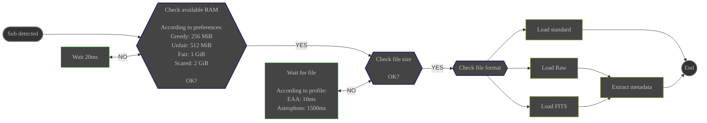

# Overview

The **Scanner** module is the entry point for your subs in ALS.

It is responsible for:
- Monitoring the **appearance** of subs in the **scan folder**
- Loading the detected subs

{}
ℹ️ **Existing files are ignored**

Files present in the **scan folder** before the **Scanner** module is started are not detected
{}

{}
ℹ️ **Detection of subs is recursive**

Subs are detected regardless of the level of subfolders where they appear within the **scan folder**

Even if they are saved in subfolders created after the **Scanner** module is started
{}

# Configuration

|                     | Source                                                                           | Data Type           | Required | Default Value |
|---------------------|----------------------------------------------------------------------------------|---------------------|----------|---------------|
| **Scan Folder**     | Preferences: [General Tab](../../userguide/preferences/general/#scan-folder)     | Path to a folder    | Yes      | ∅             |
| **Profile**         | Preferences: [General Tab](../../userguide/preferences/general/#profile)         | Choice: EAA / photo | Yes      | EAA           |
| **Memory Use**      | Preferences: [General Tab](../../userguide/preferences/general/#memory)          | fuzzy               | Yes      | "Unfair"      |

# Control

| Source                                                                          | Type                            | Response                    |
|---------------------------------------------------------------------------------|---------------------------------|-----------------------------|
| Interface: [Session Controls](../../userguide/ui/controls/#session-controls)    | Command: STOP                   | Scan folder monitoring: OFF |
| Interface: [Session Controls](../../userguide/ui/controls/#session-controls)    | Command: START                  | Scan folder monitoring: ON  |
| System event                                                                    | sub detected in the scan folder | Load the detected sub       |

# Input

| Data                     | Type              |
|--------------------------|-------------------|
| Path to the detected sub | Path to a file    |

# Behavior

## RAM Test {#ram}

Wait until the available RAM is greater than the configured value:

| Memory Use | Amount of Memory Left for the System |
|------------|--------------------------------------|
| Greedy     | 256MiB                               |
| Unfair     | 512MiB                               |
| Fair       | 1GiB                                 |
| Scared     | 2GiB                                 |

## Wait for Complete File {#wait}

Files are detected as soon as they **appear** in the **scan folder**.

To ensure file is complete before loading it:

- Poll the size of the detected file in a loop
    - Verify that the file size is stable over 2 consecutive polls

The polling interval depends on the configured profile:

| Profile        | Polling Interval |
|----------------|------------------|
| EAA            | 10ms             |
| Astrophoto     | 1500ms           |

## Image Loading {#load}

### Compatible Formats {#input-formats}

The file is loaded into memory using the format matching its filename extension.

| Extension                                                        | Format |
|------------------------------------------------------------------|--------|
| 
.jpg .jpeg
         | JPEG   |
| .png                | PNG    |
| 
.tiff .tif
         | TIFF   |
| 
.fits .fit .fts
 | FITS   |
| All other extensions                                             | Raw    |

Raw files are loaded using the libRaw library. See the [list of supported cameras](https://www.libraw.org/supported-cameras) 

## Metadata Extraction

Supported for:
- **FITS**
- **Raw**

Metadata extracted from file and incorporated into the loaded image:
- **Exposure Time**
- **Bayer Matrix** (_for subs from a color sensor_)
    - FITS files: **BAYERPAT** header
    - Raw files: standard Exif header

# Output

The loaded image is broadcast to whoever listens.

⚙️ _ALS will put the image in the **Preprocess** module's input queue for calibration_
